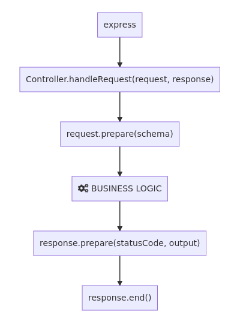

# Puro REST Framework

> In anything at all, perfection is finally attained not when there is
no longer anything to add, but when there is no longer anything to take
away, when a body has been stripped down to its nakedness.

-- Antoine de Saint-Exupéry --

## Introduction

*Puro* is an API-driven REST Framework for building robust and scalable
Web APIs.

The framework is built on top of [Express](https://expressjs.com/) and
[TypeORM](https://github.com/typeorm/typeorm). It follows the *Model-View-Controller*
pattern, where the *View* has been replaced by a simpler *Schema* (*MSC*?).

Finally, to make things dead simple, it speaks only two languages: *HTTP* and *JSON*.

## Principles

- Don't repeat yourself!
- Don't write what you don't have to!
- Do one thing and do it well!

## Features

- Plugin-oriented architecture;
- Comfortable Object-Oriented design, thanks to [Typescript](https://www.typescriptlang.org/);
- Automatic request validation;
- Automatic ORM entity resolution (*WIP*);
- Automatic response serialization (*WIP*);
- Built-in service container (*WIP*);
- Built-in logging (*WIP*);
- High-quality code and full test coverage;

## Getting Started

## The CRUD Functions

| CRUD Function | Target                 | HTTP Method | HTTP Status Code |
|---------------|------------------------|-------------|------------------|
| CREATE        | Collection             | POST        |              201 |
| READ          | Resource or Collection | GET         |              200 |
| UPDATE        | Resource               | PUT         |              204 |
| DELETE        | Resource or Collection | DELETE      |              204 |

## HTTP Exceptions

| Exception Class               | HTTP Status Code | HTTP Response Message |
|-------------------------------|------------------|-----------------------|
| HttpException                 |                - | -                     |
| BadRequestHttpException       |              400 | "Bad Request"         |
| AccessDeniedHttpException     |              403 | "Forbidden"           |
| NotFoundHttpException         |              404 | "Not Found"           |
| MethodNotAllowedHttpException |              405 | "Method Not Allowed"  |
| InvalidParameterHttpException |              422 | "Invalid Parameter"   |

## Under the Hood

## The Request

TODO

## Validating the Request

TODO

## The Response

TODO

## The Plugin

TODO

## Authors

* **Giacomo Trudu** - *Creator, Developer* - [Wicker25](https://github.com/Wicker25)

See also the list of [contributors](https://github.com/Wicker25/puro/contributors)
who participated in this project.

## License

Puro is [MIT licensed](LICENSE).
